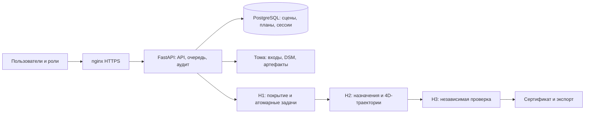

# Архитектура

| Каталог | Ответственность |
| --- | --- |
| `h1/h1_coverage/src/h1_coverage` | Канонические геометрия и покрытие |
| `h2/src/h2/routing_graph.py`, `routing_solver.py` | Граф отдельных галсов, профильные таблицы, OR-Tools Routing |
| `h2/src/h2/routing_seed.py`, `routing_blocks.py`, `routing_planner.py`, `routing_windows.py` | Компактные начальные решения, улучшения блоков, проверка кандидатов, временные окна |
| `h2/src/h2/transit.py`, `deconfliction.py` | Проверенные перелёты и разведение по времени |
| `src/gmp/safety` | Независимая геометрия, проверка ограничений, сертификаты |
| `src/gmp/api` | API, хранилища, роли, лимиты, аудит и каталог документов |
| `algorithms`, `examples`, `tests` | Навигация по методам и исполняемое доказательство поведения |
| `docs/evidence` | Измеренные CSV/JSON/XML с описанием условий |
| `deploy`, `scripts` | Установка, конфигурация, миграция, повторение испытаний |

## Контракты

H1 выдаёт группы галсов без назначения `uav_id`. Адаптер `gmp.h1_h2.v3`
передаёт H2 отдельные полные галсы; H2 сохраняет их геометрию. H3 проверяет исходную сцену и полученный маршрут независимо
от внутренних оценок H1/H2. Изменение входа лишает старый результат основания
для экспорта. Модули алгоритмов сохраняют прежние импорты для совместимости.

`gmp.coverage.engine` является мостом к каноническому H1. Старые модули
`gmp.planner` сохраняются для совместимости, но не используются LIVE API.
Не смешивайте их исторические эксперименты с текущей приёмкой.

## Параллелизм

Один процесс API владеет очередью. Файловая блокировка и PostgreSQL advisory
lock запрещают второго владельца того же пространства. Расчёты выполняются
в отдельных процессах; число одновременных расчётов определяется CPU и памятью,
максимум 8. Нативные библиотеки каждого процесса ограничены одним потоком.
Ограничения времени, адресного пространства и длины очереди предотвращают
неограниченное накопление нагрузки. При заполнении очереди API отвечает 429.

Это архитектура одного серверного узла. Горизонтальное масштабирование API,
отдельный брокер и автоматическое продолжение прерванного расчёта не заявлены.
При перезапуске прерванные задания получают явный статус, без сертификата.

Актуальная постановка, критерии и наземные работы: [current-planning.md](current-planning.md).
Форматы задания: [flight-export.md](flight-export.md); действия пользователя: [user-guide.md](user-guide.md).
