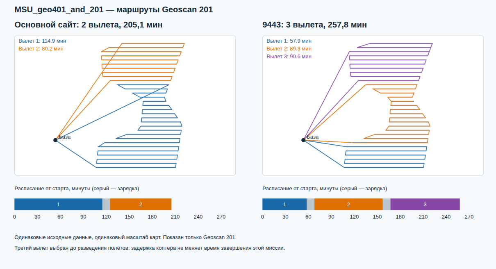

# Сравнение основного H2 и Routing на 9443

**Ограничение сравнения:** две реализации использовали разные модели времени и ресурса.
Эти замеры не позволяют сравнить качество оптимизаторов при одинаковых условиях.
Это исторический отчёт до удаления множителя 1,25 из тестовой версии.

27.09.2026. Выполнены **12 новых LIVE-расчётов через HTTPS API**: три одинаковых сценария × два критерия × два сайта. У каждой пары совпадает входной SHA-256. Бюджет запроса 60 с, seed 20260918; Routing standard. Все 12 результатов SAFE, покрытие 100%.

На основном сайте работает прежний H2: жадный старт, CP-SAT и последующая обработка. На 9443 — граф отдельных галсов и OR-Tools Routing. Алгоритмы и настройки сервисов в рамках этого сравнения не менялись; диагностические изменения модели выполнялись отдельными локальными процессами.

## Результаты

В таблице приведена **оптимизируемая метрика** в минутах. Для каждого критерия выполнен отдельный расчёт. Меньше — лучше.

| Сценарий | Критерий | Основной | 9443 | Разница 9443 | Ожидание API, основной / 9443, с |
|---|---|---:|---:|---:|---:|
| S14_MSU_geo401_and_201 | Общее время | 205.10 | 257.81 | +25.7% | 104.3 / 68.9 |
| S14_MSU_geo401_and_201 | Суммарный налёт | 266.53 | 328.36 | +23.2% | 117.1 / 69.3 |
| S15_MSU_geo401 | Общее время | 179.76 | 204.23 | +13.6% | 102.0 / 57.6 |
| S15_MSU_geo401 | Суммарный налёт | 270.93 | 315.46 | +16.4% | 102.1 / 51.1 |
| S12_MSU_4bpla_4zones | Общее время | 84.14 | 79.31 | -5.7% | 111.3 / 185.9 |
| S12_MSU_4bpla_4zones | Суммарный налёт | 197.70 | 246.84 | +24.9% | 102.9 / 40.2 |

Время API включает запуск worker, сохранение, передачу и опрос. Сервер общий; часть диагностических опытов шла параллельно. Эти значения характеризуют наблюдённое ожидание, а не изолированную скорость алгоритмов. Один прогон по каждой паре не является статистической гарантией качества.

## Почему у Geoscan 201 стало три вылета

В MSU_geo401_and_201 одинаковы не только файлы сценария, но и все 44 полилинии галсов. Изменилось разбиение задач: прежние 38 групп стали 44 отдельными обязательными галсами.

| Geoscan 201, оптимизация makespan | Основной | 9443 |
|---|---:|---:|
| Вылеты | 2 | 3 |
| Длительности вылетов, мин | 114,89 + 80,21 | 57,92 + 89,26 + 90,63 |
| Съёмка, мин | 140,63 | 138,62 |
| Транзит, мин | 40,47 | 78,18 |
| Взлёты и посадки, мин | 14 | 21 |
| Зарядки, мин | 10 | 20 |
| Завершение миссии, мин | 205,10 | 257,81 |

Часть переходов внутри прежних групп раньше относилась к фазе survey, теперь — к transit, поэтому фазовые цифры нельзя трактовать как разницу покрытия. Сам набор съёмочных линий совпадает.

[Интерактивная версия с отключением отдельных вылетов](../../docs/evidence/h2-comparison-msu.html).

Новая модель умножает время транзита на 1,25, добавляет 60 с к требованию аварийного возврата и учитывает повороты на стыках галсов. Старый Scheduler начислял повороты внутри AtomicTask, но между отдельными задачами считал время по длине перехода и рельефу без аналогичной угловой надбавки. Для Geoscan 201 радиус в модели 300 м: разворот на 180° добавляет примерно 44,6 с до коэффициента 1,25. Разбиение на отдельные галсы делает эту разницу существенной.

Если перенести **тот же старый порядок, направления и разбиение на два вылета** в текущие таблицы, первый вылет занимает 135,22 мин и требует 136,22 мин с дополнительным запасом возврата. Доступно 115,2 мин. Этот конкретный старый план отвергается новой моделью ещё до оптимизации и H3. Его формальная общая оценка 236,25 мин не является допустимым решением.

**Разведение не создало третий вылет.** В MSU исправление расписания сдвинуло один коптер на 119,751 с. Geoscan 201 не сдвигался; makespan до и после исправления одинаков: 257,805 мин. Исправление расписания вообще не делит вылеты: оно переносит старты на земле.

Старый сохранённый план 205,10 мин дополнительно пропущен через текущий независимый H3: SAFE, 100%, без нарушений. Это подтверждает, что 25%-ная надбавка и новые стоимостные штрафы являются дополнительными условиями планировщика, а не автоматически одинаковыми требованиями двух H3-проверок. Само прохождение H3 не доказывает точность аэродинамической модели поворота.

## Контролируемые опыты

Одинаковые таблицы, та же модель ресурса и seed:

| Опыт | Время поиска, с | Makespan до разведения, мин | Вылеты Geoscan 201 |
|---|---:|---:|---:|
| standard | 0.56 | 257.805 | 3 |
| 10x_work | 5.30 | 257.805 | 3 |
| 50x_work | 19.24 | 257.805 | 3 |
| 50x_lambda_001 | 20.64 | 257.805 | 3 |
| 50x_lambda_1 | 19.32 | 257.805 | 3 |
| 20x_path_lns | 16.18 | 257.805 | 3 |
| 50x_lambda_1000 | 16.69 | 257.805 | 3 |
| 50x_lambda_100000 | 16.89 | 257.805 | 3 |

Стандартный поиск остановлен после 400 000 обращений к таблицам; на этом опыте это 0,56 с. Увеличение до 20 млн обращений, изменение lambda от 0,01 до 100 000 и включение path/inactive LNS не улучшили данный экземпляр. Это не доказывает оптимальность. Название бюджета «60 с» не означает 60 с работы Routing: большую часть времени занимает построение и проверка.

Изолированные изменения **модели стоимости**, не настройки сайта:

- Без множителя 1,25, сохранив запас возврата 60 с и исходный резерв 20%, Routing нашёл два вылета и оценку 220,39 мин.
- Если дополнительно убрать новые штрафы поворотов на стыках, оценка стала 196,85 мин. Это диагностическая абляция, **не готовый SAFE-результат** и не основание молча убрать требования к манёврам.
- Попытка отдельно решить CP-SAT-подзадачу 31 обязательного галса этого самолёта максимум за два вылета на исходных текущих таблицах остановилась со статусом UNKNOWN по детерминированному лимиту. Доказательства невозможности двух вылетов не получено.

## Разведение в других сценариях

| Сценарий, makespan | До задержек, мин | После задержек, мин | Добавлено, мин |
|---|---:|---:|---:|
| S14_MSU_geo401_and_201 | 257.81 | 257.81 | 0.00 |
| S15_MSU_geo401 | 204.23 | 204.23 | 0.00 |
| S12_MSU_4bpla_4zones | 76.18 | 79.31 | 3.13 |

До задержек — восстановленное расписание тех же вылетов с самым ранним стартом и штатным обслуживанием между ними. В этих трёх сценах начальная граница окна совпадает с нулём миссии.

## Что улучшать дальше

1. **Единая модель для сравнения.** Отдельно хранить ожидаемое время и консервативную границу расхода. Калибровать время стыковых манёвров одинаково для переходов внутри старой группы и между галсами. Запасы выбирать явно, сохранять их происхождение в отчёте. Консервативный отказ по таблице можно отправлять на точную проверку кандидата; успешную проверку учитывать при уточнении таблиц. Это не разрешение принимать недопустимые планы.
2. **Проверенный старый результат как нижняя планка качества.** На общем входе и при общем независимом проверяющем этапе сохранять лучший допустимый вариант из старого и нового методов. Тогда выдаваемый результат не хуже уже полученного валидного baseline по выбранной метрике. Это стоит времени запуска baseline; для неизменного входного хеша можно переиспользовать сохранённый план.
3. **Старый план как начальное решение Routing.** После согласования стоимости/ресурса перевести группы в g+/g− и передать через ReadAssignmentFromRoutes. Сейчас прямой перенос MSU отвергается из-за ресурса. Сейчас из трёх подготовленных стартов выбирается один; отдельного поиска от каждого нет. Добавить несколько детерминированных запусков и структурные перестановки: разворот всей змейки с переключением направлений, перенос цепочек, изменение границы/слияние вылетов. Эффект этих новых операторов ещё не измерен.
4. **Настройки поиска и критерий остановки.** Калибровать лимит работы по размеру сцены, сохранять разнообразные кандидаты. Проверять стратегии первого решения, GLS/lambda, Tabu/SA, операторные наборы и LNS. Проверить масштаб очень большого коэффициента makespan относительно дуговых штрафов GLS. Не обещать улучшение от одного увеличения таймера: приведённый опыт этого не подтвердил.
5. **Учёт последующих задержек.** Включать в отбор конфликтность расписания и сохранять варианты с разными конфликтами, чтобы лучший по таблицам маршрут не проигрывал после наземных сдвигов. Для MSU_geo401_and_201 это не причина проигрыша; в S12 вклад задержек измерим.

Routing — эвристический поиск с настраиваемыми стратегиями и операторами; успешный статус не является сертификатом глобального оптимума. Настройки: [официальная документация](https://developers.google.com/optimization/routing/routing_options). Передача начального маршрута: [официальный пример](https://developers.google.com/optimization/routing/routing_tasks).

Числа, хеши, коды запусков, длительности этапов и диагностические опыты: [JSON](../../docs/evidence/h2-server-comparison.json). Все изменения в этой работе — отчёты и визуализация; код сервиса и настройки планирования не менялись.
