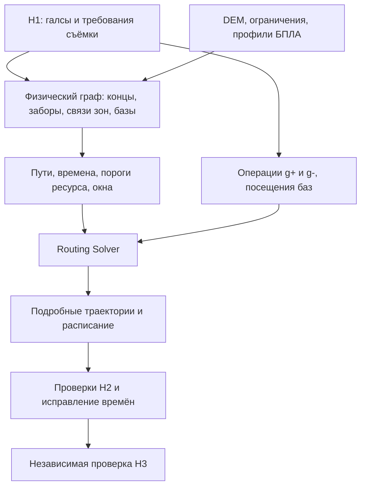

# Задание: H2 на OR-Tools Routing Solver с отдельными галсами

Дата: 27.09.2026. Автор постановки: Тимофей Розов. Рабочие исходники: `/root/h3/h2/src/h2/`.

**Статус: реализовано в рабочей копии для dev-стенда 9443.** Фактическая модель, формат v3, параметры и ограничения описаны в [routing.md](routing.md); замеры и проверки — в `docs/evidence/h2-routing.json`. Этот документ сохраняет полную постановку, а не заменяет отчёт о фактических результатах. Предыдущий алгоритм: [annealing.md](annealing.md).

Документ сохраняет исходное предложение пользователя и последующие договорённости. Разделы 1–13 задают требуемое поведение; предложения по конкретным параметрам и способам кодирования обозначены отдельно. В приложении A приведено большое сообщение пользователя о графе целиком, в приложении B — дальнейшие уточнения.

## 1. Результат, который нужно получить

Построить H2, который распределяет **отдельные галсы** между совместимыми физическими БПЛА, выбирает направления их прохождения, порядок, базы и промежуточные обслуживания. Поиск работает на заранее рассчитанных длительностях и ресурсных ограничениях. После поиска сохраняется прежняя цепочка подробных проверок, исправления расписания и независимого H3.

Главный практический эффект: один БПЛА с работой в разных частях карты должен выполнять её в разумном пространственном порядке. Границы прежних групп галсов H1 больше не должны заставлять его летать туда-сюда или отвергать всю группу, когда её отдельные галсы выполнимы разными бортами.

Согласовано:

- Пользователь явно разрешил изменить контракт H1 ↔ H2 и отменить обязательное выполнение всей прежней задачи одним БПЛА.
- **Отдельный галс остаётся неделимой операцией:** один совместимый БПЛА выполняет его полностью в одном направлении за один вылет.
- Геометрия съёмочных галсов, их связь с исходной зоной и требования к съёмке сохраняются. Разрешение разделить группу не разрешает произвольно двигать галсы или ухудшать GSD.
- Оптимизируется выбранный критерий: время завершения всей миссии (`makespan`) либо суммарное время полёта (`total_flight`).
- Внутри поиска не должны повторяться чтение DEM, подробное моделирование движения и вычисление геометрии каждого пробного маршрута.
- Ресурс ограничивает каждый вылет; после настоящей посадки и обслуживания его можно восстановить. Из любой точки полёта должна оставаться возможность долететь до разрешённой базы с запасом.
- План Routing Solver является кандидатом. Окончательная проверка H3 и условия выдачи `SAFE` сохраняются.
- Сохраняются выбор глубины, ранняя остановка простых случаев, фиксированный seed, подробные замеры этапов и крупное отображение выбранной метрики в интерфейсе.

Старый отжиг — исходный алгоритм для сравнения и возможный источник стартового решения. Обязательный дополнительный запуск прежнего отжига после Routing Solver в новую постановку не входит.

## 2. Термины и входные данные

| Объект | Значение в новой постановке |
| --- | --- |
| Исходная зона / `job` | Пользовательская область съёмки со своими требованиями |
| Прежняя задача H1 / `parent_task` | Группа галсов, ранее целиком назначавшаяся одному БПЛА |
| Галс / `transect` | Полная съёмочная полилиния от конца A до конца B; новый атом назначения |
| Физическая вершина T | Положение в графе перелётов; при необходимости также высота, курс и режим |
| Физическая база B | Реальная площадка с координатами и разрешёнными операциями |
| Логические вершины `g+`, `g-` | Два взаимоисключающих полных способа выполнить один галс |
| Логическое посещение базы | Конкретный старт, финиш либо посадка с обслуживанием на реальной площадке |
| Dummy D | Только административный выбор старта/финиша; не физическая площадка |
| Профиль p | Полный набор параметров, от которых зависят траектория, время и ресурс |
| БПЛА u | Конкретный физический борт со своим расписанием и разрешениями |

Для каждого галса сохранить стабильный `transect_id`, `parent_task_id`, `job_id`, исходную полилинию, направление, требования к датчику/профилю съёмки, высоте AGL, разрешению и окнам времени. Если вход не содержит ID галса, детерминированно получить его из ID родительской задачи и индекса в исходном списке; совпадение координат само по себе не означает одинаковое задание.

Для каждого борта нужны ID, полный профиль, установленные датчики, ограничения ветра, полётного времени, скоростей, высот и манёвров, время взлёта/посадки/обслуживания, интервалы доступности и разрешения по базам. Один борт с несколькими датчиками — **одна машина**, а не несколько независимо летающих машин.

Поддерживать существующие модели `geoscan_201`, `geoscan_401`, `geoscan_701`, `geoscan_801`, `geoscan_gemini` через параметры профиля, без особой ветки оптимизации для каждого имени.

Для баз нужны координаты, `role`, `candidate`, совместимость с бортами и возможность фактического обслуживания. Предлагаемая площадка (`candidate=true`) не становится действующей автоматически. Посадочная или резервная площадка не обязательно допускает заправку и повторный взлёт.

Сценарий также задаёт DEM либо явно выбранную плоскость, разрешённую область, препятствия, постоянные и временные запретные зоны, окно миссии, световой день и параметры безопасности. Неизвестные высоты/NoData нельзя молча заменять нулём. Источник рельефа сохраняется в происхождении результата.

## 3. Два уровня графа

### 3.1. Почему нужны два уровня

**Физический граф** описывает, где можно лететь и сколько стоит каждый перелёт. Транзитные вершины и участки могут использоваться многократно, в том числе разными БПЛА.

**Граф Routing Solver** описывает обязательные операции съёмки и конкретные посещения баз. Его дуга содержит уже рассчитанный путь по физическому графу. Обычную транзитную точку нельзя просто сделать необязательным клиентом Routing: одно такое логическое посещение не моделирует произвольное количество пролётов через эту точку.



### 3.2. Физический «забор» внутри прежней задачи H1

У каждого галса выделить два конца. Для соседних галсов одной прежней группы соединить концы на одной стороне и отдельно концы на другой стороне. Сохранить сами полилинии галсов. Получается лестница/забор, позволяющий собрать оба вида змейки и пройти их в обоих направлениях.

```text
L1 ================= R1    галс 1
|                    |
L2 ================= R2    галс 2
|                    |
L3 ================= R3    галс 3
```

Обозначения L/R относятся к согласованным сторонам семейства галсов, а не буквально к меньшему/большему X. H1 может уже отдавать соседние галсы в противоположных направлениях: нельзя соединять «первые координаты» без учёта этого. Для ломаного галса сохраняется вся полилиния, а не хорда между концами.

Связи концов — кандидаты на реальные перелёты. Каждое направление рассчитывается и проверяется отдельно: соединяющий отрезок не получает разрешение пересечь NFZ, препятствие или недопустимый рельеф лишь потому, что он находится внутри старой группы.

Вырожденные случаи:

- Один галс: два различных конца, две ориентации обслуживания.
- Два галса: четыре конца, обе поперечные связи.
- Непараллельные, разорванные или обрезанные препятствиями группы: использовать реальную структуру и порядок H1; невозможную связь убрать с причиной.
- Соседние чанки одного `job` могут быть разными `parent_task`. Не запрещать связь между ними только из-за общего `job_id`; использовать подсказки соседства H1, если они есть.

### 3.3. Связи между прежними задачами

У прежней задачи выделить угловые концы: теоретические входы/выходы двух змеек. Обычно это четыре конца крайних галсов; у одного галса остаются два уникальных конца.

Для каждого углового конца найти K ближайших угловых концов **других прежних задач**, создать кандидаты связей, затем рассчитать их реальные траектории и стоимости. Близость для KNN измерять в метрической CRS. Совпадающие расстояния разрешать детерминированно по ID.

Исходное предложение пользователя: `K ≈ 3–5`. Рабочее начальное предложение для реализации: `K=4`, с увеличением при плохой связности. Это параметр поиска, не закон допустимости полёта.

Поиск соседей может быть несимметричным. Для выбранной пары концов предусмотреть расчёт обеих направленных связей, если полёт допустим; время и допустимость в обратную сторону не копировать автоматически.

### 3.4. Связи с базами

Уточнение пользователя от 27.09.2026 отменяет первоначальное `K_base≈15`: **каждую реальную базу соединить со всеми угловыми концами**. База → конец и конец → база являются разными направленными операциями. Учитывать роли площадки и разрешения конкретного борта.

Тем же уточнением **перелёты база → база запрещены**. Реальные базы не являются транзитными точками кратчайших путей. Между двумя посещениями базы должно быть обслуживание хотя бы одного галса. Направленные административные связи dummy остаются.

Кроме KNN, добавить разреженные дальние связи между углами разных групп.
Реализация: не более двух предложений от угла, две полосы дальности,
предпочтение разных направлений, стабильный порядок при равенствах.
Никакой случайности при выборе рёбер; seed поиска фиксирован.

### 3.5. Связность и допустимость

После построения проверить по каждому профилю и разрешениям борта достижимость совместимых галсов от разрешённых стартов и достижимость разрешённой посадки после них. Проверка направленная; обычной связности без направления недостаточно.

При разрыве увеличивать K, добавлять физически проверенные мосты между компонентами либо явно сообщать об ограничении построенного графа. **Отсутствие решения в разреженном графе не доказывает невозможность исходной миссии.** Даже связный KNN-граф может давать хуже маршруты, чем более плотный; влияние K нужно измерять.

Запрещённый переход должен быть запрещён ограничением модели. Просто очень большая конечная цена недостаточна: solver может выбрать её, если остальные варианты ещё хуже.

### 3.6. Курсы, высоты и склейка

Состояние на границе съёмочного галса включает координаты, AGL/AMSL и направление движения. Для самолёта цена и допустимость поворота зависят от входящего и выходящего курса. Нельзя независимо посчитать рёбра между точками, а затем бесплатно склеить их в острый разворот.

При реализации выбрать и документировать один из корректных способов: граф с состояниями курса/входящего ребра либо заранее рассчитанные соединения фиксированных граничных состояний. Консервативная надбавка на неизвестный курс допустима только как явно описанное приближение; сама по себе она не доказывает пространственную выполнимость манёвра.

## 4. Как заставить solver пройти весь галс

### 4.1. Две направленные операции вместо обязательной середины

Первоначальная идея с обязательной точкой C посередине заменяется **двумя операциями обслуживания**:

| Узел Routing | Вход | Обязательное действие | Выход |
| --- | --- | --- | --- |
| `g+` | A | Пройти всю съёмочную полилинию A → B | B |
| `g-` | B | Пройти всю съёмочную полилинию B → A | A |

Схематично это именно обсуждавшееся `A → g+ → B` и `B → g- → A`. Но в Routing каждый `g` — одна полная операция, а A/B — её входное/выходное состояние в физическом графе, не два дополнительных обязательных клиента.

Для каждого исходного галса:

```text
Active(g+) + Active(g-) = 1
```

Ровно одна ориентация выбирается **на весь флот**, а не по одной на каждый борт. Если обе ориентации недоступны всем бортам, полного решения нет в данной модели; нельзя молча убрать галс.

Посещение середины само по себе не задаёт полного обслуживания. Особенно после замены физических путей матрицей кратчайших переходов пропадает гарантия, что до/после такого клиента будет пройден именно требуемый галс. Направленная операция сохраняет эту гарантию явно.

В установленном OR-Tools 9.10.4067 точное условие может задаваться `AddDisjunction([plus_index, minus_index], -1, 1)`: отрицательный penalty требует ровно одну активную вершину. Альтернатива — необязательные варианты плюс явное равенство активностей. **Положительный штраф за пропуск не эквивалентен обязательности.** Это подтверждается локальным docstring и [документацией RoutingModel](https://or-tools.github.io/docs/python/classortools_1_1constraint__solver_1_1pywrapcp_1_1RoutingModel.html).

### 4.2. Время операции и перехода

Для профиля p заранее сохранить:

- `s_p(i)` — полный полёт при обслуживании направленного галса i;
- `entry(i)`, `exit(i)` — его граничные состояния;
- `d_p(i,j)` — перелёт от `exit(i)` до `entry(j)`;
- подробную геометрию и ресурсные требования обоих фрагментов.

При договорённости «обслуживание оплачивается на выходящей дуге»:

```text
flight_p(i,j) = s_p(i) + d_p(i,j)
```

Дуга от последнего галса к посадке обязана включать обслуживание последнего галса. Начальная дуга включает настоящий взлёт; конечная — посадку. Нулевой dummy-переход только выбирает базу, не отменяя эти времена.

Пример: прибытие на A в 20-й секунде и 100 секунд съёмки означают выход из B не раньше 120-й секунды. Следующий перелёт начинается из B, а не из A или середины.

Обычный транзит по геометрии галса не отмечает его выполненным. Выполнение засчитывается по выбранной операции, датчику, режиму съёмки и полной восстановленной траектории.

### 4.3. Что стало с четырьмя вариантами старой задачи

Раньше группа имела две змейки × два направления = четыре варианта целиком. Теперь группа из N галсов даёт 2N направленных кандидатов, из которых выбирается ровно N — по одному на галс. Старые четыре варианта остаются возможными порядками, если их соединения допустимы, но больше не ограничивают все варианты назначения и порядка.

## 5. Разные БПЛА, датчики и eligibility

Routing получает **одну машину на один физический БПЛА**, с маршрутом на всю миссию, включая промежуточные обслуживания. Не создавать независимую машину на каждый вылет: без дополнительных связей это разрешило бы одному борту находиться в двух местах одновременно.

Для каждой направленной операции и борта заранее определить допустимость:

1. Доступен требуемый датчик/профиль, поддерживаются условия съёмки и GSD.
2. Допустимы ветер, класс борта, высоты, скорость и полный проход галса.
3. Галс с подходом/возвратом потенциально помещается в ресурс; у направлений могут быть разные результаты.
4. Соблюдаются индивидуальные запреты борта и разрешения баз.
5. Не нарушаются ограничения, переданные H1 как обязательные.

Разные борта с одинаковыми параметрами могут использовать общие таблицы времени. Однако их `eligible`-наборы, старты, финиши, доступность и расписания остаются отдельными. Ключ кэша — полный набор влияющих параметров, а не только строка `model` или тип датчика. Разные допустимые базы возврата требуют разных полей возврата даже при одинаковой аэродинамике.

Ограничение машин для вершины задаётся через `SetAllowedVehiclesForIndex` или эквивалентные ограничения. **Пустой список в этом API не использовать для запрета всем:** явно деактивировать невозможную ориентацию. Если другая ориентация тоже невозможна, сохранить диагностическую причину.

Изменение атомарности требует пересмотреть и H1 feasibility. Запрет по отсутствию датчика сохраняется. Запрет только из-за длины всей старой группы или небезопасного старого соединения галсов нельзя автоматически считать запретом каждого отдельного галса. Такие случаи должен явно переоценить H1/новый согласованный адаптер с причинами; H2 не должен молча расширять старую матрицу совместимости.

Для двух заданий с разными датчиками совпадающая геометрия не означает, что обслуживание одного автоматически выполнило другое. Совместную съёмку можно засчитывать только при явной поддержке этого режима контрактом.

## 6. Старт, финиш, дозаправка и dummy

### 6.1. Три разных разрешения

Для каждого борта u задать:

```text
S_u — разрешённые базы первоначального старта;
F_u — разрешённые базы окончательной посадки;
R_u — разрешённые базы промежуточного обслуживания и повторного взлёта.
```

Пример: старт и окончательный финиш закреплены на A, обслуживаться можно на A, B и C. Тогда `A → галсы → B → обслуживание → галсы → C → обслуживание → галсы → A` допустим по назначению баз.

Отдельно определить множество баз гарантированного возврата `E_u`. Это могут быть базы обслуживания `R_u` либо явно разрешённые аварийные посадочные площадки. Способность аварийно приземлиться и способность продолжить миссию после заправки — разные требования. Для более строгого предлагаемого режима использовать базы обслуживания; если сохраняется отдельная аварийная политика, записать её явно и показывать в результате. Dummy не входит ни в одно физическое множество.

Точная схема новых полей и миграции — часть реализации. Старое `allow_different_start_end=false` нельзя игнорировать: нужно определить, означает ли оно совпадение концов каждого вылета или только всей миссии, и сохранить прежнюю семантику для старой версии входа. Аналогично нельзя незаметно превратить старое закрепление каждой посадки в разрешение на любую промежуточную базу.

### 6.2. Как устроить dummy без телепортации

При свободном первоначальном размещении создать персональный терминал `D_start(u)`:

```text
D_start(u) → b_start,  b ∈ S_u, стоимость 0
```

У него нет входящих физических дуг. При свободном окончательном финише создать **другой** терминал `D_end(u)`:

```text
b_finish → D_end(u),  b ∈ F_u, стоимость 0
```

У него нет исходящих физических дуг. При фиксированной базе можно использовать фиксированный логический старт/финиш; единообразная схема с dummy и единственным разрешённым выбором тоже допустима.

Просто направить рёбра к одному общему dummy недостаточно: если у него есть вход с B1 и выход к B2, появится бесплатное `B1 → D → B2`. Поэтому dummy используются только в начале/конце маршрута и **исключаются из графа кратчайших перелётов и поля возврата**.

Для неиспользованного БПЛА предусмотреть пустой маршрут без фиктивного взлёта, посадки и обслуживания. Пустой маршрут не подтверждает перемещение между двумя различными базами. Если вход требует обязательного перебазирования даже неиспользованного борта, это отдельная реальная операция.

### 6.3. Повторные посещения и обслуживание

Обычный логический узел Routing нельзя посетить несколько раз. Поэтому у одной физической базы должны быть несколько логических копий обслуживания. Они ссылаются на одни координаты, но имеют разные ID посещения.

Число копий конечно и влияет на размер модели. Выбрать начальный лимит, сохранять его в параметрах и при исчерпании расширять. Недостаток копий не выдавать за физическую невыполнимость. При положительном минимальном времени обслуживания горизонт миссии даёт верхнюю оценку числа посещений; при нулевом обслуживании и цепочках баз нужен отдельный аргумент/лимит, а не деление на ноль. Удаление симметрии копий не должно убирать реальные порядки баз.

Рекомендуемое явное представление одного обслуживания:

```text
... → b_arrive → b_depart → ...
       посадка    новый взлёт после обслуживания
```

Оба узла одной копии выбираются вместе, принадлежат одному борту и идут непосредственно друг за другом. Между ними борт стоит на этой базе. Время посадки входит в предыдущий полёт, время взлёта — в следующий; обслуживание и наземное ожидание находятся между вылетами.

Первоначальный старт не обязан оплачивать обслуживание уже готового борта. Окончательная посадка не требует обслуживания после окончания миссии. Промежуточная посадка с намерением продолжить полёт требует обслуживания по правилам сцены; полный ресурс не появляется от простого пролёта над координатами базы.

В текущем H3 минимальный промежуток между вылетами — `max(uav.service_time_s, mission.service_time_min * 60)`. Эта семантика должна сохраниться, пока новая версия входа явно не задаст более подробные правила.

## 7. Две величины: календарное время и полётный ресурс

### 7.1. Существующая модель расхода

Сейчас отдельной электрической модели батареи нет. Полезный бюджет борта:

```text
B_u = operational_endurance_min * 60 * (1 - energy_reserve_fraction)
R(t) = B_u - время_полёта_с_начала_текущего_вылета
```

Это секунды полётного ресурса. Взлёт, съёмка, перелёты, посадка и ожидание в воздухе расходуют его. Набор высоты и развороты влияют на длительность движения; отдельной мощности в ваттах/Вт·ч эта модель не рассчитывает.

На земле календарное время идёт, а ресурс полёта не расходуется. После полного обслуживания начинается следующий вылет с `B_u`. Название «энергия» в коде не должно вводить в заблуждение относительно этой модели.

Нужны раздельные состояния:

```text
T — календарное время от общего начала расчётного окна;
E — израсходованный полётный ресурс после последнего восстановления;
0 <= E <= B_u,  оставшийся ресурс R = B_u - E.
```

### 7.2. Сброс ресурса в Routing

Обычная capacity-dimension лишь ограничивает накопление. Посещение вершины с названием «база» само по себе ничего не сбрасывает. Нужен явно проверенный reload-механизм.

Для парного посещения базы требуемая семантика:

```text
T_depart >= T_arrive + service_time
E_depart = 0
```

Возможная реализация через ресурсную dimension: на единственной дуге `b_arrive → b_depart` задать transit `-B_u`, разрешить ресурсный slack в `b_arrive` и при активном посещении потребовать `E_depart=0`. Из равенства dimension следует `slack_E = B_u - E_arrive`; тем самым сброс полный и точно привязан к обслуживанию. На обычных дугах transit равен полётному времени, ресурсный slack равен нулю. Для разных бортов используются их собственные capacity и transit. Неактивные копии не должны накладывать ограничения на действующий маршрут.

Это **предложение способа кодирования**, которое требуется проверить небольшими моделями перед интеграцией. Официальный [пример reload](https://github.com/google/or-tools/blob/stable/ortools/constraint_solver/samples/cvrp_reload.py) показывает базовый подход с отрицательным расходом и slack; специфические связи наших пар баз нужно добавить самостоятельно.

Ресурсный slack сброса — техническая величина, не время ожидания. Календарный slack разрешён только на земле. У клиентов нельзя бесплатно «подождать до окна» без расхода ресурса. Если в будущем разрешается ожидание в воздухе, оно должно иметь физическую траекторию, время, расход и проверки; в первоначальной реализации сдвигать вылет с базы.

### 7.3. Возможность вернуться из любой точки

Для профиля и разрешённых баз возврата заранее рассчитать:

```text
r_u(x) = min по b ∈ E_u [время допустимого возврата из состояния x на b + посадка]
```

Положение x включает существенные высоту и курс. Если возврата нет, значение бесконечно и соответствующий фрагмент недопустим. Для направленного графа поле возврата считать поиском от баз по обращённым дугам, с правильной исходной стоимостью посадки.

Одной проверки концов недостаточно. Для полного съёмочного или транзитного фрагмента f сохранить два различных числа:

```text
tau_u(f) — сколько ресурса фактически расходует фрагмент;
Q_u(f) = max(tau_u(f), max по состояниям x внутри полёта
                       [prefix_time_f(x) + r_u(x) + margin_u(x)]).
```

Войти во фрагмент разрешено только при `R_in >= Q_u(f)`. На выходе `R_out = R_in - tau_u(f)`: **Q — порог входа, а не расход**. Дополнительный запас не должен списываться заново на каждом ребре. Штатный reserve уже вычтен из B; дополнительный margin относится к ошибке приближения и политике возврата. После завершённой посадки требование аварийного возврата больше не применяется.

Пример: до точки внутри фрагмента 8 минут полёта, возврат оттуда 12 минут, дополнительный запас 2 минуты. В начале фрагмента нужно не менее 22 минут, даже если сам фрагмент занимает меньше.

Для обслуживания i и следующего перелёта i → j порог композиции:

```text
tau(i,j) = s(i) + d(i,j)
Q(i,j) = max(Q_service(i), s(i) + Q_transfer(i,j))
```

Для выбранной дуги и выбранного борта наложить условное ограничение:

```text
Next(i) = j AND Vehicle(i) = u  =>  E_i + Q_u(i,j) <= B_u
```

Это отдельное ограничение поверх обычной capacity. Реализовать через корректную таблицу/element/reified-ограничения, учитывая неактивные вершины и терминалы. Нельзя пересчитывать Q внутри callback и нельзя отключать условие для последнего галса. У ресурсного сброса и административных dummy-дуг свои специальные правила, без выдуманного воздушного участка.

### 7.4. Дискретизация и консервативность

Дальние перелёты и галсы подробно дискретизуются **на этапе подготовки**. Необязательно превращать каждую точку дискретизации в посещение Routing: результат проверки сворачивается в Q и сохранённую траекторию.

Проверить только дискретные точки и добавить произвольный процент недостаточно для гарантии между ними. Допустимый консервативный способ — из промежуточной точки учитывать продолжение по проверенному сегменту до следующего опорного состояния, а затем возврат оттуда, с верхней оценкой времени. Проверяются также рельеф и препятствия между отсчётами.

Ранее пользователь попросил **больший запас, чтобы не проваливать H3**. В текущем сеточном оценщике есть коэффициент времени 1,25, высотный запас перелёта 30 м, горизонтальный буфер 10 м и дополнительный запас возврата 60 с. Это действующие параметры старого приближения, описанные в [fixed-estimator.md](fixed-estimator.md), а не автоматически правильные константы для нового подробного графа. При переносе не ослаблять ограничения без обоснования и замеров; не прибавлять один и тот же запас дважды. Высоту съёмки нельзя повышать ради запаса ценой ухудшения GSD.

## 8. Предрасчёт и быстрые callbacks

Последовательность подготовки:

1. Проверить вход и версии контрактов, получить индивидуальные галсы из H1.
2. Сформировать полные профили, совместимость и разрешения реальных бортов.
3. Построить физический граф из раздела 3, включая граничные состояния.
4. Для каждого профиля подробно рассчитать оба направления каждого совместимого галса: время, траекторию, физическую допустимость. Это полный прогон по модели движения, а не длина/средняя скорость.
5. Аналогично рассчитать направленные физические рёбра: рельеф, набор/снижение, повороты, запреты, границы сцены. Кандидат KNN не обязан давать прямой перелёт: сохранить построенный допустимый обход.
6. Построить поля возврата к разрешённым реальным базам и Q всех нужных фрагментов.
7. Найти пути между выходами/входами операций и базами. Для логической дуги сохранить время, Q, ограничения времени и ссылку на конкретный физический путь.
8. Подготовить целочисленные таблицы и структуру посещений баз для Routing.

Путь между клиентами может проходить через обычные T и геометрию других галсов, не обслуживая их. Транзит и съёмка на одинаковой геометрии могут иметь разные высоту, скорость, курс и стоимость; для них нужны соответствующие режимы/состояния. Нельзя бесплатно заменить съёмочную операцию более быстрым транзитом или дважды начислить время одного обслуживания. Если он пролетает над базой, ресурс сам не восстанавливается. Скрытая посадка/заправка внутри матричной дуги запрещена: это должно быть отдельное посещение базы в маршруте.

**Кратчайший путь определяется временем по конкретному профилю и выбранной модели.** Стоимости направленные. Даже при одинаковой геометрической длине A–B и B–A состояния высоты/курса, ограничения и взлёт/посадка могут различаться. Расход по ветру не добавлять из головы: использовать согласованную модель движения, сохранив ограничения ветра.

Один самый быстрый путь может иметь больший Q, чем немного более длинный путь рядом с базой. Аналогично разные пути могут пересекать разные временные запреты. Если сохраняется только один путь на пару, это **ограничение модели**. При необходимости держать несколько недоминируемых вариантов `(время, Q, окна)` и явно моделировать выбор пути. Не обещать полноту относительно всех физических маршрутов при одной сохранённой альтернативе.

Внутри transit callbacks допустимы только обращения к готовым таблицам и простая арифметика. Нельзя вызывать Dijkstra/A*, DEM, построение траектории, H1 или H3. Дорогие промахи кэша должны завершиться до соответствующего запуска solver. Геометрию хранить по ссылкам на рёбра/деревья путей, чтобы не дублировать огромные массивы точек в каждой ячейке.

Ключ предрасчёта включает геометрию и версии H1, содержимое DEM, ограничения, профили/датчики, параметры дискретизации и запасов, разрешения возврата, модель времени и версию алгоритма. Изменение сцены инвалидирует соответствующие таблицы.

### 8.1. Временные ограничения на фиксированных путях

Сохранять окно миссии, световой день, окна задач/датчиков и временные NFZ. Статический вес времени не означает, что все времена старта разрешены.

Для фиксированной траектории заранее вычислить интервалы пересечения каждой временной зоны в относительном времени. Если пересечение происходит на `[alpha, beta]` от начала фрагмента, а запрет активен на `[a,b]`, запрещены те старты t, при которых интервалы `[t+alpha,t+beta]` и `[a,b]` пересекаются. Границы обработать с согласованным допуском. Получаются интервалы разрешённых стартов без повторного GIS в поиске.

Ограничения, зависящие от выбранной дуги, накладывать условно на эту дугу. Окно начала операции и требование выполнить **весь** фрагмент внутри окна — разные правила; унаследовать семантику входного поля. После обслуживания/задержек все окна остаются обязательными.

Допустим более консервативный вариант, как в текущей сетке: часть временных зон считать постоянно закрытой. Тогда это явно отражается в параметрах и причинах отказа; невозможность в такой модели не доказывает невозможность с разрешённым временем пролёта. Постоянный запас сам по себе не компенсирует закрытие базы/коридора по времени: нужны допустимые окна возврата либо консервативный постоянно доступный путь.

### 8.2. Числа для solver

Выбрать единый целочисленный масштаб, например 1000 единиц/секунду. Времена и Q округлять вверх, ресурс и верхние границы окон — в безопасную сторону вниз; нижние границы окон — вверх. Проверить накопленную погрешность, 64-битное переполнение и согласованность единиц.

Недоступность хранить отдельно от цены. В callbacks нужны конечные технические значения, но невозможные дуги и назначения дополнительно исключаются ограничениями, а не одним большим sentinel-числом.

## 9. Полный набор ограничений Routing

| Требование | Что должна обеспечить модель |
| --- | --- |
| Несколько БПЛА | Одна машина на каждый физический ID |
| Разные характеристики | Матрицы transit/cost и capacity по профилю/борту |
| Обязательная съёмка | Ровно один из `g+`, `g-` для каждого галса на весь флот |
| Полный галс | Фиксированный вход, полная операция, фиксированный выход |
| Датчик, ветер, режим, манёвр | Разрешённые машины для каждой ориентации |
| Неиспользованный борт | Пустой маршрут без выдуманного полёта |
| Фиксированный/свободный старт | Выбор только из `S_u` |
| Фиксированный/свободный финиш | Выбор только из `F_u`, без промежуточного выхода через dummy |
| Дозаправка | Только `R_u`, фактическая посадка и обслуживание |
| Повторные обслуживания | Копии посещений одной физической площадки |
| Один борт между вылетами | Последовательность, непрерывность баз, время обслуживания |
| Лимит вылета | `0 <= E <= B_u`, сброс только после обслуживания |
| Постоянная возможность возврата | `E_i + Q_u(i,j) <= B_u` на выбранных воздушных дугах |
| Длительность миссии | Календарное время с полётом, обслуживанием и наземным ожиданием |
| Ограничения времени | Миссия, световой день, задачи, пересечения временных NFZ |
| Запрещённые перелёты | Дуги исключены, а не только оштрафованы |
| Рельеф и препятствия | Проверенные физические пути с исходными DEM/правилами |
| Многократный транзит | Разрешён физическим графом, не расходует посещение клиента |
| Общая ёмкость площадки | Если задана сценой — согласование занятости/обслуживания |
| Межбортовое расстояние в 4D | Подробная проверка и исправление после solver |
| Полное покрытие и GSD | Сохранение заданий в Routing плюс независимая проверка зон в H3 |

Размерности времени и ресурса можно строить через семейство `AddDimension*`, в том числе с разными transit и capacity по машинам; [официальное описание dimensions](https://developers.google.com/optimization/routing/dimensions) объясняет связь cumul/transit/slack. Условия обслуживания, выбора ориентации, Q и запретов нужно добавить явно.

Не полагаться на то, что любую комбинацию пользовательских ограничений эффективно обработают все эвристики Routing. На маленьких моделях проверить совместимость построения первого решения, локального поиска, resource-reset и обязательных альтернатив. Производительность этих ограничений измеряется отдельно.

## 10. Целевая функция и запуск solver

### 10.1. Два критерия без подмены

`total_flight` — сумма времени всех реальных вылетов всех БПЛА: взлёт, съёмка, транзит, воздушное ожидание при его наличии и посадка. Наземные ожидания и обслуживание не входят. Нельзя минимизировать только расстояние или переходы между клиентами, забыв съёмку: разные борта могут выполнять её с разной длительностью.

`makespan` — время до последней окончательной посадки от **общего фиксированного начала** расчётного окна. Начало должно совпадать с принятой семантикой UI/H3, включая световой день. Нельзя считать каждый маршрут от его собственного позднего взлёта, делая задержки бесплатными.

Для makespan можно использовать временную dimension с общим нулём виртуальных стартов и ожиданием на начальных базах. Тогда максимум конечных cumul отражает время окончания миссии. При использовании `SetGlobalSpanCostCoefficient` отдельно проверить это равенство: при свободных разных начальных cumul global span может означать другую величину. Не включать незаметно дополнительную сумму дуг в основной критерий.

Для равенства основной метрики можно использовать второй критерий и стабильный порядок ID. Лексикографический порядок реализовать явно: двухэтапно либо коэффициентом с доказанной верхней границей младшего критерия и проверкой переполнения. Произвольный большой коэффициент может изменить задачу.

Обязательные галсы не покупаются штрафом. Отдельный режим неполной диагностики допустим, но результат помечается как неполный, не сравнивается с полным как более быстрый и не выдаётся за успешное выполнение миссии.

### 10.2. Первое решение и улучшение

Предлагаемый порядок реализации:

1. Подготовить `RoutingIndexManager`, терминалы машин, варианты галсов и копии баз.
2. Зарегистрировать таблицы; наложить все ограничения до запуска.
3. Получить первое решение встроенной эвристикой, например `PARALLEL_CHEAPEST_INSERTION`; сравнить с другими стратегиями на наших данных. Это кандидат настройки, не доказанный лучший выбор.
4. При необходимости преобразовать допустимый прежний план в галсы и посещения баз и подать как начальный маршрут. Старые прямые перелёты могут отсутствовать в новом графе: такой старт сначала проверить/спроецировать.
5. Улучшать маршруты локальным поиском Routing. Начальный кандидат — `GUIDED_LOCAL_SEARCH`; сравнить с `SIMULATED_ANNEALING` на обоих критериях. Это не обязательный запуск старого внешнего отжига H2.
6. Сохранять несколько различных лучших полных решений для подробной проверки. Различие — назначения/направления/порядок/базы, а не только другой timestamp того же маршрута.

Стратегии, метаэвристики и стандартные лимиты описаны в [Routing Options](https://developers.google.com/optimization/routing/routing_options). Набор операторов выбрать экспериментально, в том числе для пар обслуживания и обязательных альтернатив.

Не делать полный старый H2 обязательной дорогой прелюдией: в S17 он занимал около 33 секунд. Его запуск как источник первого решения оправдан измеренным улучшением общего результата/времени. Сохранение старого **завершающего этапа** не означает сохранение старого назначения задач.

### 10.3. Seed, детерминизм и остановка

Требование пользователя: seed строго фиксирован, повторные запуски на одинаковом входе воспроизводимы. Сохранить базовый seed `20260918`; дополнительные старты получают заранее определённые производные seed.

Зафиксировать порядок ID, KNN при равенстве расстояний, выбор равных кратчайших путей, версии OR-Tools/модели, настройки, стартовые маршруты и лимиты работы. Проверять хеш результата без служебных timestamps и runtime.

**Один seed не обеспечивает воспроизводимость поиска, остановленного по стенному времени.** Нагруженность сервера изменяет число рассмотренных ходов. Штатно использовать детерминированный объём работы и критерий отсутствия улучшения; отдельно оставить аварийный wall-clock timeout и отмену пользователем. Прерывание отмечается; найденный кандидат всё равно проходит проверки.

У локального `RoutingSearchParameters` версии 9.10.4067 нет универсального поля верхнего уровня `random_seed`. Проверить механизмы seed конкретного backend и поисковых компонентов; не записывать несуществующий параметр и не выдавать `sat_parameters.random_seed` за управление всем Routing. Один поток и seed не заменяют проверку повторных запусков.

Конкретный monitor/лимит числа ветвей, отказов, решений или ходов проверить на установленной версии. Лимит числа найденных решений сам по себе не гарантирует раннюю остановку, если новых решений нет. Малые случаи завершать при исчерпании разумного объёма работы/плато либо доказанном достижении нижней границы, не выжидая минуту.

### 10.4. Глубина

Сохранить `quick`, `standard`, `deep`. Глубина увеличивает объём поиска, число стартов и финалистов. K, число альтернативных путей и копий баз тоже влияют на расчёт, но изменяют модель: их записывать отдельно.

Точные числа подобрать измерением. Ориентир пользователя: обычный расчёт около минуты или немного больше; для `alotofZones` допустимы минуты; простой случай завершается быстро. Это цель по **всей цепочке**, а не только таймеру solver.

Для прежнего отжига было 2/4/7 финалистов по глубинам; это возможная отправная точка. Конечный лимит финалистов не гарантирует выбор лучшего из всех физически безопасных планов. Для разных начальных решений использовать детерминированный порядок запуска, фиксированную работу и честно учитывать их суммарную стоимость.

## 11. Прежний завершающий этап

### 11.1. Восстановление кандидата

Для каждого выбранного решения:

1. Разобрать маршрут физического борта, отделить административные узлы от реальных действий.
2. Разбить маршрут на вылеты по фактическим посадкам/обслуживанию.
3. Вставить полные исходные галсы и сохранённые физические пути переходов.
4. Построить подробные 4D-точки: координаты, AGL/AMSL, время, скорость, фазу, остаток ресурса, связь с `transect_id`/`parent_task_id`/`job_id`.
5. Проверить согласованность со стоимостью поиска. Если подробная модель требует больше времени/ресурса или другого манёвра, нельзя оставить прежнюю выгодную оценку и выдать `FEASIBLE`.

Если при материализации путь меняется, его время, Q и окна пересчитываются вне оптимизационного цикла, зависимое расписание обновляется и проверяется заново. Расхождение сохраняется в диагностике предрасчёта.

### 11.2. Проверки и жадное исправление

Сохранить проверки непрерывных сегментов/межбортового сближения, NFZ, разрешённых времён, ресурса, баз, обслуживания, рельефа, манёвров, датчиков, высоты/GSD и покрытия.

При конфликте попробовать небольшую задержку первого и второго борта и выбрать более выгодную допустимую. Последующие вылеты того же борта сдвигать только насколько нужно для обслуживания и последовательности. Задержка на земле не расходует полётный ресурс, но ухудшает календарное время и может нарушить окно миссии/световой день.

Для временной NFZ сдвинуть старт на ближайшее разрешённое время по фактическому интервалу пересечения. После исправления повторить все затронутые проверки. Нельзя бесконечно раздвигать миссию или лечить невозможный поворот/недостаток ресурса одной задержкой.

Ограничить число попыток и величину сдвига. Текущий `anneal_repair.py` использует до 64 раундов и параметр `max_shift_s=600`; это отправные настройки, не новое требование пользователя. Неисправленный кандидат отклоняется; проверить следующий либо выполнить явно ограниченный повтор поиска с уточнёнными условиями.

После исправлений сравнивать по **фактической основной метрике**, а не оценке до задержек. Полнота выполнения обязательна.

### 11.3. Две обязательные адаптации

**Атомарность и покрытие.** Убрать требование, что все галсы родительской задачи выполняет один борт. Проверять каждый обязательный `transect_id` ровно один раз в операциях обслуживания и полный проход выбранного направления совместимым БПЛА. Геометрический транзит/пересечение не является вторым назначением. H3 сохраняет проверку объединённого покрытия исходного `job` и качества съёмки: отметки назначения недостаточно.

**Назначения баз.** Сейчас `h3_core.py` проверяет закреплённые `start_site`/`landing_site` на каждом вылете. Для нового контракта проверять `S_u` при первоначальном старте, `F_u` при окончательной посадке, `R_u` при промежуточном обслуживании. Сохраняются непрерывность местоположения и длительность обслуживания. Старые версии входа проверяются по прежним правилам до явной миграции.

Также адаптировать метрики/экспорт, остаток ресурса, пороги возврата и provenance. Нельзя просто переименовать `task_id`, отключив строгие проверки. Постоянный возврат проверять при финальной материализации; не считать его автоматически доказанным старым H3, если тот проверяет только общий остаток времени.

### 11.4. Независимый H3 и интерфейс

Подробный кандидат передаётся в независимый H3. Только он выдаёт `SAFE` и сертификат по результатам полной проверки. Неполный диагностический маршрут не становится успешно выполненной миссией.

По завершении крупно показать выбранный критерий в «Обзоре» и на карте, как уже сделано для отжига. Рядом — статус, полнота, неназначенные галсы/затронутые зоны и второй критерий. Метрика окончательного плана включает задержки; время вычисления показывается отдельно от времени миссии.

Различать причины: не найдено за бюджет, нет пути в построенном графе, мало копий/альтернатив, конфликт H3, доказанное противоречие входных ограничений. Ни таймаут эвристики, ни `None` от solver сами по себе не доказывают физическую невыполнимость.

## 12. План работы в репозитории

Это инструкция будущему исполнителю, а не отчёт о выполненной реализации.

1. Перед изменениями шва/API выполнить `make validate` из `/root`, свериться с [evidence](../../docs/evidence/README.md), прочитать [контракт](../../docs/contract/H1_H2.md), [seam](../../docs/contract/seam.md), [READY](../../docs/contract/H1_READY.md). Пользователь уже разрешил изменение атомарности; старый запрет не является основанием вновь просить то же разрешение.
2. Зафиксировать новую версию/семантику входа и выхода, миграцию галсов и баз. Не называть новую обязательную схему старой версией и не подменять старые фикстуры без обновления контракта.
3. Адаптировать канонический H1 через существующий bridge, без второй реализации покрытия внутри H3. Экспортировать галсы и корректную совместимость. H1 не назначает борт и время.
4. Реализовать физический граф, направленные стоимости, путь восстановления и Q; проверить геометрию и ресурсные инварианты отдельно.
5. На малых задачах реализовать Routing: ориентации, индивидуальные борта, базы/dummy, повторное обслуживание, время, ресурс и Q. Сравнить с полным перебором.
6. Добавить окна, оба критерия, детерминированный поиск, финалистов и журнал стадий.
7. Адаптировать материализацию/финальные проверки; подключить H3 и UI, сохранив авторитетность safety-результата.
8. Сравнить старый и новый H2 на одинаковых входах и обоих критериях, замерить S17 и повторы.
9. После правок шва выполнить `python3 h3/scripts/validate_h1_h2_contract.py` из `/root`, релевантные H1/H2/H3 и API-проверки. Документацию/evidence обновлять фактическими результатами.

Основные места интеграции:

| Файл/каталог | Назначение |
| --- | --- |
| [`../src/h2/planner.py`](../src/h2/planner.py) | Выбор алгоритма H2 |
| [`../src/h2/contract.py`](../src/h2/contract.py) | Чтение/валидация контракта |
| [`../src/h2/fixed_estimator.py`](../src/h2/fixed_estimator.py) | Предрасчёт, оценка, материализация текущего режима |
| [`../src/h2/estimate_grid.py`](../src/h2/estimate_grid.py) | Сетка и возврат |
| [`../src/h2/scheduler.py`](../src/h2/scheduler.py) | Подробная модель движения и настройки |
| [`../src/h2/annealing.py`](../src/h2/annealing.py) | Текущий поиск и управление финалистами |
| [`../src/h2/anneal_repair.py`](../src/h2/anneal_repair.py) | Исправление конфликтов и времён |
| [`../src/h2/checks.py`](../src/h2/checks.py) | Проверки результата H2 |
| [`../src/h2/benchmark/vrptw.py`](../src/h2/benchmark/vrptw.py) | Отдельный пример Routing/VRPTW, ещё не требуемая БПЛА-модель |
| [`../../src/gmp/api/h2_adapter.py`](../../src/gmp/api/h2_adapter.py) | Сцена, базы, экспорт вылетов |
| [`../../src/gmp/api/planner_adapter.py`](../../src/gmp/api/planner_adapter.py) | Цепочка H1 → H2 → H3, прогресс/метрики |
| [`../../src/gmp/safety/h3_core.py`](../../src/gmp/safety/h3_core.py) | Независимые проверки |
| [`../../web/h3/`](../../web/h3/) | Настройки, карта и крупная метрика |

Рабочий dev-сайт этой ветки — `https://45.87.246.124:9443/`, исходники `/root/h3`. Этот документ не требует менять production на 443. На текущем шаге создаётся документация, без включения новой модели и без коммита всех накопленных изменений.

## 13. Производительность, проверки и приёмка

### 13.1. Замеры

Сохранять времена отдельно: H1; физический граф; подробные галсы/рёбра; поля возврата; матрицы путей/Q; создание ограничений; первое решение; улучшение Routing; материализация финалистов; исправление расписания; независимый H3; вся цепочка от кнопки до результата. Различать холодный и тёплый кэш.

Фиксировать размер модели: физические вершины/дуги по профилям, число галсов/ориентаций, разрешённые назначения, базы/копии, логические дуги/альтернативы, память и число точек траекторий. Подтвердить отсутствие дорогой физики внутри callbacks. Измерять качество вместе со временем, а не только скорость получения любого результата.

Главный большой пример: `src/gmp/scenario_templates/S17_MSU_geo401_RGB_and_Lidar_alotofZones/input`. В прежнем замере — 117 задач H1, 384 галса, три физических БПЛА, два полных профиля. Внутренний `scene_id` шаблона — `S01_msu_100km2`.

Новая модель здесь даст 768 кандидатов обслуживания до удаления недоступных ориентаций и добавления баз. Полная таблица между 768 ориентациями имеет 589 824 ячейки на профиль; два профиля — 1 179 648 ячеек, без баз. Разреженность физического KNN-графа не означает такую же разреженность матрицы логических переходов.

Базовые **старые** результаты отжига, не прогноз новой реализации:

| S17, standard | Время |
| --- | ---: |
| Подготовка старого оценщика | 6,17 с |
| Прежний начальный H2 | 32,76 с |
| Отжиг | 15,08 с |
| Подробные финалисты | 24,68 с |
| H2 всего | 78,67 с |
| H1/H2 и подготовка метрик H3 | 122,33 с |
| Отдельная независимая повторная проверка H3 | 44,58 с |
| Основная цепочка с этой проверкой | 166,91 с |

Тот результат был **неполным**: 72/117 назначенных старых задач, около 79,90% покрытия, `UNSAFE`, без сертификата. Не приписывать новому алгоритму улучшение полного решения по более короткому неполному. Дополнительные автоматические прогоны рекомендаций сервиса после отказа не входили в замер. Источник: [annealing.md](annealing.md) и [evidence](../../docs/evidence/h2-annealing.json).

Ранее оценка одного уже заданного плана после подготовки занимала около 0,04 с, повтор с кэшем — единицы миллисекунд. Это замер прежнего оценщика, **не время решения новой комбинаторной задачи Routing**. Новый подробный предрасчёт и поиск ещё предстоит измерить.

### 13.2. Содержательные тесты

| Случай | Проверяемый результат |
| --- | --- |
| Один галс, два направления | Ровно одно полное обслуживание; время последнего галса учтено |
| Несколько галсов группы | Обе старые змейки возможны; галсы распределяются между бортами |
| Ломаный галс | Проходится исходная полилиния, не хорда |
| Датчик/ветер несовместимы | Назначение запрещено; пустой allowed-набор не разрешает всем |
| Два одинаковых профиля с разными разрешениями | Кэш не смешивает индивидуальные условия |
| Асимметричные направления | Нет автоматического копирования обратной стоимости |
| Посещена только середина | Задание не считается выполненным |
| Транзит через чужой галс | Нет случайного засчитывания съёмки |
| Старт/финиш/dummy | Только разрешённые базы, нет бесплатной телепортации |
| Два обслуживания одной базы | Копии работают; обслуживание оплачено дважды |
| Дозаправка на другой базе | Непрерывность борта между вылетами |
| Landing/reserve без обслуживания | Нельзя заправиться и стартовать автоматически |
| Сброс ресурса | Только после посадки и обслуживания, полный и правильный для борта |
| Q строже длительности | Короткий фрагмент отклоняется при невозможном возврате из середины |
| Q как порог | Запас не списывается заново на каждом ребре |
| Опасность между отсчётами | Нет ложной гарантии по одним концам |
| Альтернативный путь рядом с базой | Ограничения выбора только быстрейшего пути выявлены |
| Ожидание окна | На земле; нет бесплатного зависания в воздухе |
| Временная NFZ/световой день | Фактические интервалы, включая задержки |
| Два конфликтующих борта | Малый сдвиг исправляет конфликт либо кандидат отклонён |
| Старые закрепления баз | Совместимость по версии, без молчаливого ослабления |
| Мало связей/копий/времени поиска | Нет ложного доказательства физической невозможности |
| Оба критерия на малой сцене | Сравнение с полным перебором маршрутов и баз |
| Чередующиеся удалённые задачи | Измеримое устранение лишних перелётов |
| Повтор одинакового запуска | Совпадают назначения, направления, базы, времена и хеш |
| Простой случай | Ранняя остановка без минутного ожидания |
| DEM, препятствия, самолёт | Подробные проверки не отключены ради успеха |
| S17 и малые шаблоны | Время стадий, оба критерия, статус и реальное покрытие |

### 13.3. Условия завершения реализации

- Новый режим проходит контрактную, интеграционную и содержательную проверку инвариантов.
- Каждый галс имеет ровно одно полноценное обслуживание либо явно указан в диагностике неуспешного/неполного результата.
- Нет скрытой заправки, телепортации, неподтверждённого расширения eligibility или изменения геометрии съёмки.
- Возврат обеспечивается по всему пути; запас и допустимые базы известны.
- В поиске используются подготовленные данные, без подробного моделирования внутри перебора.
- Финальный H3 сохраняется с адаптацией атомарности/баз; метрика соответствует итоговому расписанию.
- Есть воспроизводимые замеры старого и нового алгоритма на одинаковых входах и честные причины отказа.
- В UI видны критерий, глубина, стадии, окончательное время/налёт, полнота и статус проверки.

## 14. Согласованные требования и выбор при реализации

**Согласовано:** отдельные галсы; обе ориентации полного прохода; физический забор и KNN; направленные веса по БПЛА; реальные базы и терминальные dummy; ресурс/обслуживание; выбор разрешённых промежуточных баз; возврат из любой точки; предрасчёт; прежний финальный этап с адаптациями.

**Текущие параметры реализации:** `K=4` плюс до двух дальних связей от угла; все базы со всеми углами, без база—база; пары узлов обслуживания; reset через отрицательный transit; insertion + GLS; масштаб 0,1 секунды. Первоначальное предложение `K_base=15` в цитате ниже оставлено как история и отменено уточнением §3.4.

**Нужно явно зафиксировать в реализации:** версию полей галсов/баз; миграцию закреплений; множество баз гарантированного возврата; представление курсов; количество альтернативных путей и копий баз; политику временных зон; механизм seed и лимиты работы; пределы коррекции расписания. Выбирать совместимые значения и документировать; спрашивать пользователя только при реальной неоднозначности требований.

## Приложение A. Исходное большое сообщение пользователя о графе

Сообщение перенесено целиком, с опечатками; пробелы и Markdown-разметка нормализованы. Последующие уточнения заменяют обязательную середину на две направленные операции полного прохода.

> так, сейчас мы с тобой должны придумать, как жестко формализовать задачу для ROuting solver. Я предлагаю селать следующее.
>
> 1) нарушаем контракт с H1. забиваем на обязательные требования прохождения всей задачи целиком одним бпла.
>
> 2) рисуем граф так:
>
> для каждого имеющегося галса в середине ставим вершину типа C (client)- именно такие вершины обязательно надо будет посетить хотя бы однкратно. этой вершине соответсвует mission, в котоорой прописано, что эту вершину должен посетить бпла, обладающий соответсвующим типом датчика.
>
> по краям галса ставим вершины типа T - обычные транзитные вершины, на них нет никаких требований.
>
> делаем вершины для баз типа B
>
> и делаем дамми-базы D для бпла с неопределенно йвершиной
>
> отрезки строим так: внутри старой задачи из H1 соединяем все вершины в простой "забор" - типа края соседних галсов соединяем и все (так чтобы оба вида змейки можно было проделать через полученных граф). дальше для бывших задач берем 4 "угловые вершины" - то есть теоретические начала и концы змеек, выделяем их в отдельный набор и в этом наборе соединяем их меду собой. можно делать это чисто по knn, то есть угловая вершина должны соединяться с k ближайшими угловыми вершинами из других зон) k условно 3-4-5 например может быть. аналогично для каждой базы соединеям их с KNN угловых вершин (я думаю здесь k должно быть уже сильно больше, около 15 мб) и еще проводим от dummy базы до обычных баз ребра
>
> далее задачем каждоому ребру вес на основании нормального расчета (то есть буквально так, как мы это делаем сейчас в алгоритме), а ребрамот нормльных баз до дамми-баз - вес 0. Причем веса ребрам даются для каждого из типов бпла разные. то есть сколько типов, столько наборов весов
>
> то есть буквально это все сделать:
>
> | Что нужноВ OR-Tools | |
> | --- | --- |
> | несколько машин | да |
> | разные типы машин | да |
> | разные матрицы расхода по типам | да, через отдельные transit callbacks / vehicle-specific costs |
> | ограничение запаса топлива/энергии | да, через `Dimension` с capacity для каждой машины |
> | несколько депо | да |
> | конкретная машина → конкретное депо | да, через `starts[]` / `ends[]` |
> | каждый клиент посетить ровно один раз | да, это базовая routing-модель, если не разрешать пропуски |
> | | |
> | миссия требует определённый датчик | да, ограничиваешь допустимые машины для вершины |
> | машина имеет несколько датчиков | да, просто при подготовке модели считаешь, какие миссии ей разрешены |
> | разные лимиты энергии для разных машин | да |
> | разные cost function для разных машин | да |
>
> и запустить этот самый великий solver?

## Приложение B. Все последующие вопросы и договорённости

1. **«можешь уточнить, что ты придумал про то как заставить его пройти весь галс целиком? то есть как именно будет выглядить граф?»** Две операции с фиксированными входом, полным съёмочным проходом и выходом. Нельзя выбрать только середину, сократить галс или выйти с того же конца. Время обслуживания включается в исходящую дугу; подробно — раздел 4.

2. **«ааа то есть типа направленные вершины от A к B через g+ и в обратную сторону через g- и требование посетить любую из +/-?»** Да: ровно одна ориентация на весь флот, одним совместимым бортом. Схематично `A → g+ → B` и `B → g- → A`.

3. **«так, а dummy вершины если соединить с другими базами направленными ребрами, это решит проблему?»** Да, если стартовый dummy имеет только исходящие связи, конечный — только входящие. Один проходной dummy с обоими видами связей даёт бесплатное перемещение между базами. Dummy исключены из физических путей и возврата — раздел 6.2.

4. **«так,ну то что время полета конечно и надо возвращаться и пополнять его какое-то время как реализовать ты знаешь да?»** Один маршрут машины охватывает несколько вылетов. Календарное время и ресурс ведутся отдельно; посадка/обслуживание восстанавливают ресурс. База не сбрасывает capacity автоматически; нужны копии посещений и явные reset-ограничения — разделы 6.3 и 7.

5. **«кстати а бпла могут возвращаться толлько на свою ьазу чтобы дозаправиться или на любую? надо что ли как-то это выделить, типа кроме старта и финиша еще делать базу дозаправки и ее можно выбрать любой. это тоже реализуемо?»** Да: разрешённые базы обслуживания отдельно от первоначального старта и окончательной посадки. Одна площадка может иметь несколько ролей. Текущие проверки закрепления базы на каждом вылете адаптируются; нельзя поменять только solver и оставить противоречащий старый H3 — разделы 6.1 и 11.3.

6. **«и как реализовать необходимость доступности базы ты тоже знаешьь? я думал просто взять вершины и... моно еще дискретизовать дальние перелеты и короче следелать так чтобы модно было туда залетать ток с достаточным ресурсом вот»** Для фрагмента предрассчитывается максимум «расход до точки + возврат + запас». Вход только с достаточным остатком. Проверяются середины перелётов и галсов; точки проверки не обязаны быть клиентами solver — разделы 7.3–7.4.

7. **«короче, я правильно понимаю что все сведется к задаче на заданном графе без необходимости что-то пересчитывать в процессе оптимизации?»** Да, дорогая физика и геометрия вынесены в подготовку. Solver продолжает считать суммы, времена, ресурс и ограничения; это не отсутствие вычислений вообще. Коллизии/окончательная физическая проверка остаются после выбора кандидатов — разделы 8–11.

8. **«так, ну завершающий этап старый да?»** Да: подробные траектории, полные проверки, небольшие задержки вылетов при конфликтах/временных запретах, повторная проверка и независимый H3. Главные адаптации — отдельный галс и разделение первоначальных/конечных/промежуточных баз — раздел 11.

Сохранён и предыдущий контекст: ресурс измеряется временем полёта; два критерия различаются; нужен запас возврата; seed фиксирован; простые сцены не считаются минутами; результат должен быть проверенным и пространственно разумным. Routing Solver и CP-SAT — разные решатели/подходы внутри OR-Tools, а не обязательные последовательные стадии. Здесь выбрана маршрутная постановка Routing, а не прежнее CP-SAT-назначение целых групп.
